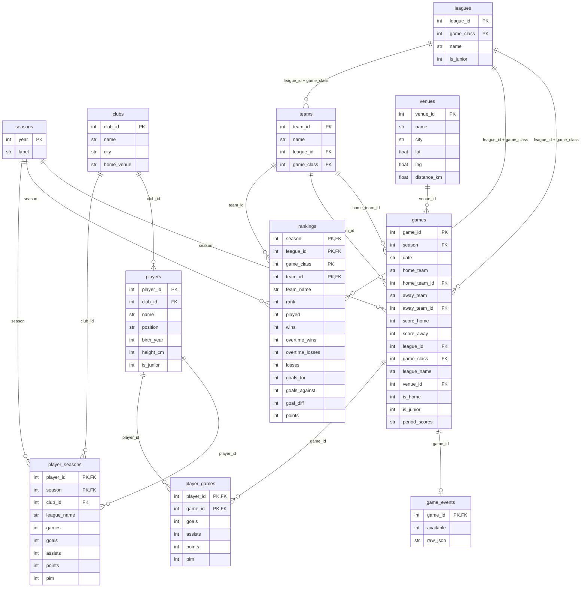

```mermaid
erDiagram
    seasons {
        int year PK
        str label
    }

    leagues {
        int league_id PK
        int game_class PK
        str name
        int is_junior
    }

    games {
        int game_id PK
        int season FK
        str date
        str home_team
        int home_team_id FK
        str away_team
        int away_team_id FK
        int score_home
        int score_away
        int league_id FK
        int game_class FK
        str league_name
        int venue_id FK
        int is_home
        int is_junior
        str period_scores
    }

    game_events {
        int game_id PK, FK
        int available
        str raw_json
    }

    rankings {
        int season PK, FK
        int league_id PK, FK
        int game_class PK
        int team_id PK, FK
        str team_name
        int rank
        int played
        int wins
        int overtime_wins
        int overtime_losses
        int losses
        int goals_for
        int goals_against
        int goal_diff
        int points
    }

    clubs {
        int club_id PK
        str name
        str city
        str home_venue
    }

    teams {
        int team_id PK
        str name
        int league_id FK
        int game_class FK
    }

    venues {
        int venue_id PK
        str name
        str city
        float lat
        float lng
        float distance_km
    }

    players {
        int player_id PK
        int club_id FK
        str name
        str position
        int birth_year
        int height_cm
        int is_junior
    }

    player_seasons {
        int player_id PK, FK
        int season PK, FK
        int club_id FK
        str league_name
        int games
        int goals
        int assists
        int points
        int pim
    }

    player_games {
        int player_id PK, FK
        int game_id PK, FK
        int goals
        int assists
        int points
        int pim
    }

    seasons ||--o{ games : "season"
    seasons ||--o{ rankings : "season"
    seasons ||--o{ player_seasons : "season"

    leagues ||--o{ games : "league_id + game_class"
    leagues ||--o{ rankings : "league_id + game_class"

    games ||--o| game_events : "game_id"
    games ||--o{ player_games : "game_id"

    venues ||--o{ games : "venue_id"
    teams ||--o{ games : "home_team_id"
    teams ||--o{ games : "away_team_id"
    teams ||--o{ rankings : "team_id"
    leagues ||--o{ teams : "league_id + game_class"

    clubs ||--o{ players : "club_id"
    clubs ||--o{ player_seasons : "club_id"

    players ||--o{ player_seasons : "player_id"
    players ||--o{ player_games : "player_id"
```
